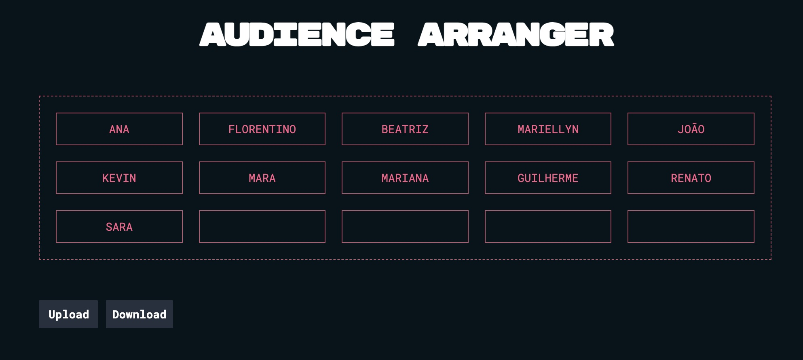

# Audience Arranger

<p align="center"></p>

<div align="center">

<a href="">[]()</a>

</div>
The Audience Arranger is a JavaScript application designed to manage and display an audience list. It features drag-and-drop reordering of audience members, file upload and download functionalities.

## Implementation Details

This application allows users to upload a list of names that can be arranged in a visual representation of an audience. The new arrangement can be downloaded into a file and it is automatically saved to a local storage for improved user experience.

### Modular Codebase

To implement a well-organized and modular codebase, the application uses ES6 modules with a clear separation of concerns.

- **audience.js**: this module handles the management and rendering of the audience list.
- **drag-drop.js**: encapsulates drag-and-drop functionality.
- **file-upload.js**: uploads and updates of the application state.
- **file-download.js**: manages generation and download of the audience list

### Initialization

The `init` function receives the `STATE` object, initializes the event-listeners and oversees the rendering of the audience.

## Usage

### Getting Started

To integrate the Audience Arranger into your project, import the `init` function from the `app.js` module or invoke it directly.

```javascript
<script type="module">import {init} from './app.js'; init(STATE);</script>
```

### Customization

Customize the application to your needs by changing the number of columns and DOM element IDs for the audience, file input, and file output. The `STATE` object provides a clear structure for configuration.

```js
const STATE = {
  names: [
    'Ana',
    'Beatriz',
    'Florentino',
    'Guilherme',
    'João',
    'Kevin',
    'Mara',
    'Mariana',
    'Mariellyn',
    'Renato',
    'Sara',
  ],
  audience: {
    id: 'audience',
    numberOfColumns: 5,
  },
  handlers: {
    drag: {
      element: null,
      index: null,
    },
    drop: {
      element: null,
      index: null,
    },
  },
  fileInputID: 'file-input',
  fileOutputID: 'file-output',
};
```

### File Format

When uploading a TXT file, adhere to the demonstrated format in the provided assets. Empty name entries correspond to unoccupied seats.

```plaintext
# BEATLES

- Paul
- George
-
- John
- Ringo
```

> **Note:**
>
> The `fillEmptyBlocks` function will automatically populate the remaining seats in the row.

## License

[MIT](https://choosealicense.com/licenses/mit/);
